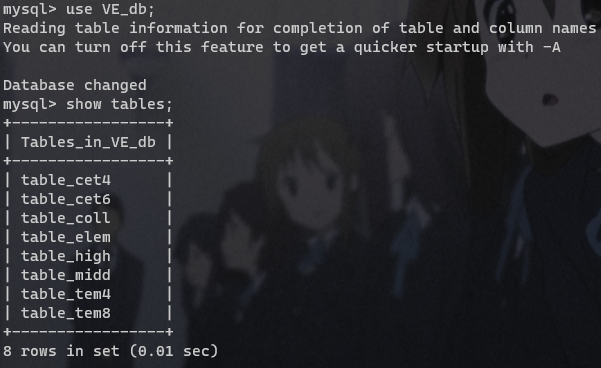

<!--
 * @Autor: violet apricity ( Zhuangpx )
 * @Date: 2023-06-12 14:50:39
 * @LastEditors: violet apricity ( Zhuangpx )
 * @LastEditTime: 2023-06-20 15:01:54
 * @FilePath: \px-vocabulary_estm\plan.md
 * @Description:  Zhuangpx : Violet && Apricity:/ The warmth of the sun in the winter /
-->
# plan

## 这是个啥

vocabulary estm (default:en) = 英语词汇量估算
就是一个估算词汇量的东西，由于数据局限，面向的是国内学生（小-初-高-大学-cet-tem）。

## 要干些什么（提纲）

1. 数据收集
   - 词汇表（标签）
   - 词汇量范围划分
2. 前端
   - html + js
3. 后端
   - 和前端交互
   - 算法设计 - 阶梯式上下升估算
   - MySQL（预）处理
   - 批处理验证
   - ~~用户系统~~
4. 实验报告
   - 小组报告

## 数据收集

### 词汇表（标签）

按照：小学-初中-高中-大学-cet4-cet6-tem4-tem8。

### 词汇量划分（词汇量范围）

参考[英语词汇量是怎么划分等级?](https://www.zhihu.com/question/378683109)

综合采用：

| 标签 | 词汇量范围   |
| ---- | ------------ |
| 小学 | [0, 905]     |
| 初中 | [905, 2124]  |
| 高中 | [2124, 4124] |
| 大学 | [4124, 4440] |
| cet4 | [4440, 5500] |
| cet6 | [5500, 6000] |
| tem4 | [6000, 8000] |
| tem8 | [8000,13000] |

## 数据库

取数据集然后去重。

只有一个：



## 前后端架构

### 前端

简单html+js。~~（不懂前端）~~

### 后端

cpp，顺手。

环境是Ubuntu（wsl）。

### 交互

cpp->cgi，一些能用js写的地方直接拿cpp暴力改了~~（省力）~~。

没拿服务器，用的是py的cgi容器。

### 流程

- index
  - single_estm_init
    - single_estm
    - single_estm_result
  - batch_estm
    - batch_estm_result

## 词汇量估算算法 - 阶梯式上下升估算

大致方向是根据词汇表预估范围区间。

于是每个表就是一个阶梯，动态上下升。

初始rand（取中）定位初始阶梯，维护总的答题数和准确数，以及每阶答题数和准确数，动态上下升。

- ac

  - if( rate>=0.8 且 sum>=5)：上升
  - else：水平推进

- wa

  - if( rate<=0.2 且 sum>=5)：下降
  - else：水平推荐

- 结果：

  - 对每个阶梯：

    - 词汇量：下界+区间长度*阶梯命中率，即下界+偏移
    - 权值：阶梯数对总数占比

  - 每个阶梯词汇量*权值，加权平均

  - 如：

    ```c++
    long long Cal_vcb_estm() {
      long long ans = 0;
      for(auto idx : id_list_) {
        //  枚举词汇表/阶梯
        auto identify = identify_map_[idx];
        //  当前阶梯准确率
        double rate = 1.0 * identify.relize_sum_ / identify.relize_sum_;
        //  当前阶梯词汇量 = L + Rate * (R-L+1)
        long long vcb_size = Lower_bound[idx] + (long long)((Upper_bound[idx] - Lower_bound[idx]) * rate);
        //  当前阶梯权重
        double weight = 1.0 * identify.sum_ / sum_;
        //  阶梯词汇量*阶梯权值 加权平均
        ans += (long long)(vcb_size * weight);
      }
      return ans;
    }
    ```

## 批处理验证

钦定实际词汇量为n，喂给算法得出估算值m，对比n和m。

## 跑起来

先创建数据库：

```mysql
CREATE DATABASE VE_test;
```

然后进行数据库预处理（`init.cpp`数据库登录提前换账号密码）：

```c++
g++ init.cpp -o init.exe -I/usr/include/mysql -L/usr/lib -lmysqlclient -lmysqlcppconn
./init.exe
```

之后make一下：

```c++
make
// make clean
```

再启动服务器，这里用py自带的cgi容器代替：

```shell
python3.8 -m http.server --cgi 8080
```

之后去访问首页(`http://localhost:8080/static/index.html`)就行了
